##  Prasyarat Sistem
Sebelum memulai instalasi, pastikan sistem Anda telah memasang perangkat lunak berikut:
* **PHP** (v8.3 atau lebih baru)
* **Composer**
* **Node.js** (v16 atau lebih baru) & **NPM**
* **MySQL** atau MariaDB (via XAMPP, Laragon, dll)

---

##  Cara Instalasi

Proyek ini terbagi menjadi dua bagian: `backend` dan `frontend`. Anda harus menjalankan keduanya agar aplikasi berfungsi dengan baik.

### Tahap 1: Instalasi Backend (Laravel)

1. Jalankan Server Lokal, pastikan Anda sudah membuka Laragon/Xampp/Sejenisnya dan menekan tombol **Start** pada layanan **Apache/Nginx** dan **MySQL**.

2. Buat database, buka phpMyAdmin (biasanya di `http://localhost/phpmyadmin`) atau aplikasi database client lainnya seperti tableplus, lalu buat satu database kosong dengan nama `nama_database_anda`.

3. Buka command prompt, lalu masuk ke direktori backend:
`cd backend`

4. Instal semua dependensi PHP menggunakan Composer:
`composer install`

5. Salin file konfigurasi environment:
`cp .env.example .env`

6. Buka file .env dan sesuaikan konfigurasi database Anda:

`DB_CONNECTION=mysql`
`DB_HOST=127.0.0.1`
`DB_PORT=3306`
`DB_DATABASE=nama_database_anda`
`DB_USERNAME=root`
`DB_PASSWORD=`

4. Buat Application Key Laravel:
`php artisan key:generate`

5. Jalankan migrasi database (pastikan database kosong sudah dibuat di MySQL):
`php artisan migrate`

6. Membuat tautan (symbolic link) untuk storage
`php artisan storage:link`

6. Jalankan server backend:
`php artisan serve`

Backend API sekarang berjalan di http://localhost:8000

### Tahap 2: Instalasi Frontend (React)

1. Buka tab terminal jalankan command prompt baru (biarkan terminal backend tetap berjalan).
Masuk ke direktori frontend:
`cd frontend`

2. Instal semua dependensi Node.js:
`npm install`

3. Salin file konfigurasi environment:
`cp .env.example .env`

4. Buka file .env dan sesuaikan konfigurasi seperti ini:
VITE_API_URL=http://localhost:8000/api

5. Jalankan server development frontend:
`npm run dev`

Frontend sekarang berjalan, biasanya di http://localhost:5173

### Penggunaan Awal
Buka browser dan akses URL frontend Anda (contoh: http://localhost:5173).

Klik Daftar Sekarang untuk membuat akun Administrator baru.

Setelah berhasil mendaftar, lakukan Login menggunakan Email dan Password tersebut.

Anda akan langsung diarahkan ke Dashboard untuk mulai mengelola data RT

## 🗄️ Entity Relationship Diagram (ERD)
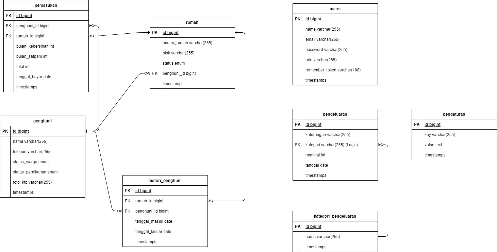

##  Screenshot Fitur Aplikasi

**1. Halaman Dashboard**
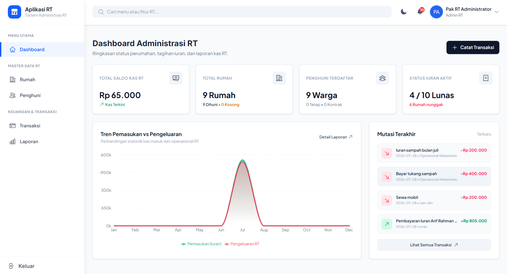
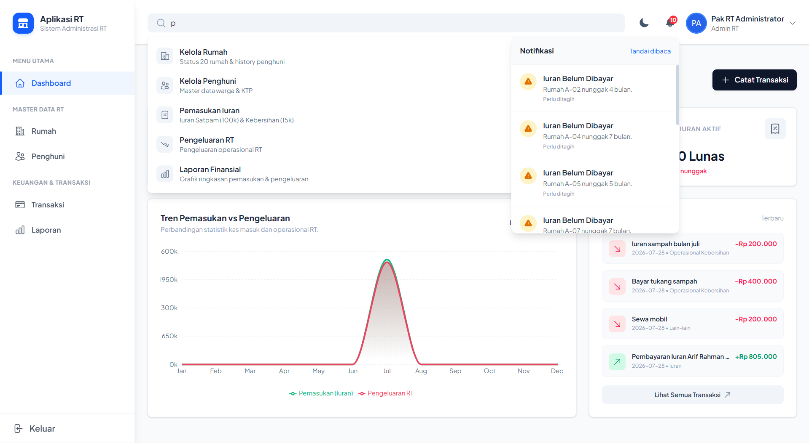

**2. Halaman Rumah**
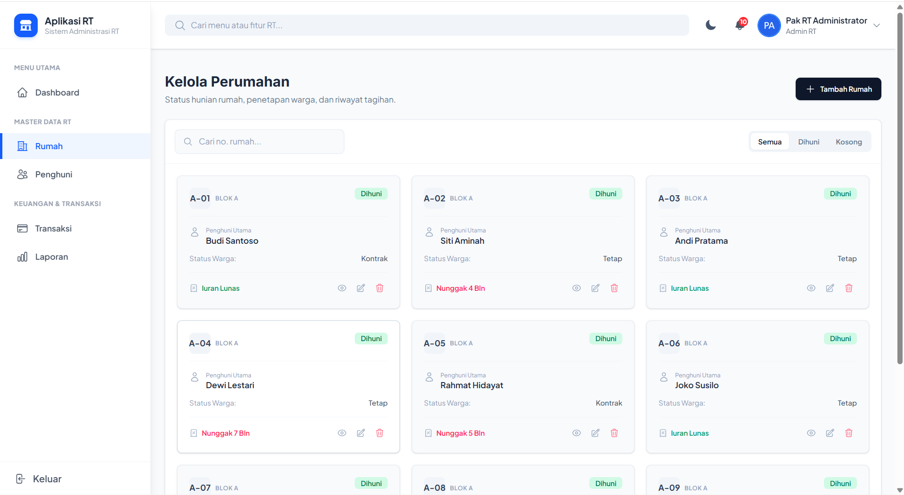
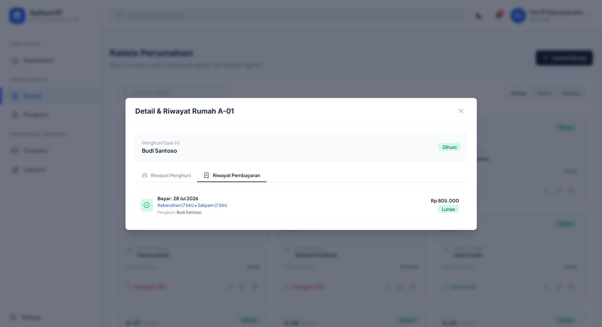
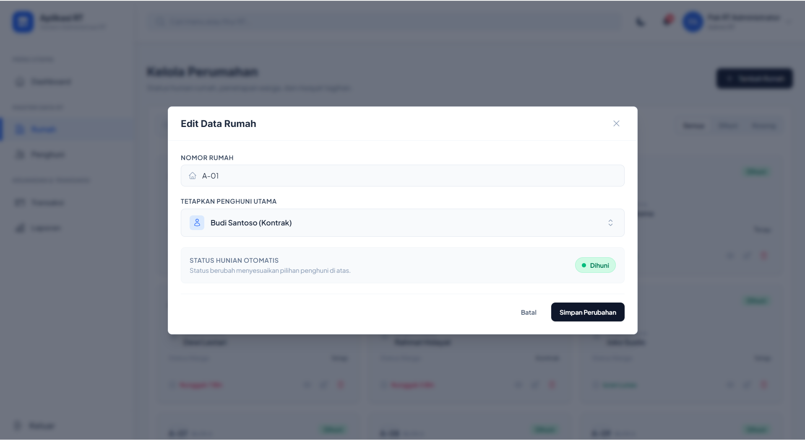

**3. Halaman Penghuni**
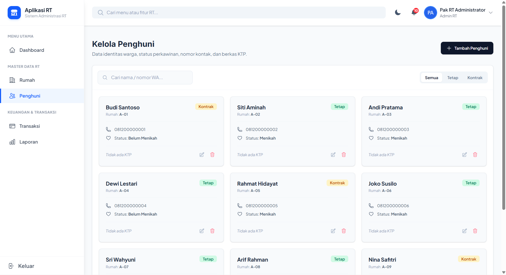
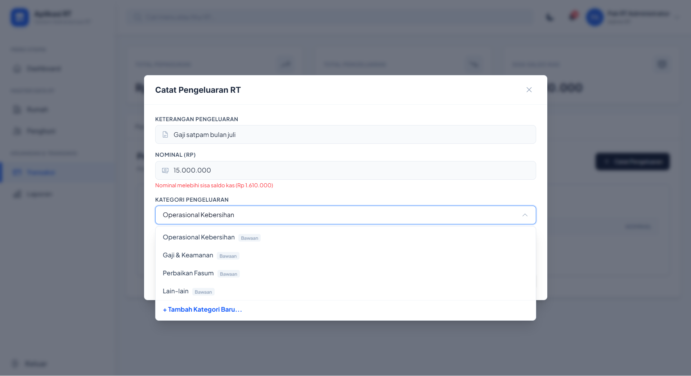

**4. Halaman Pemasukan**
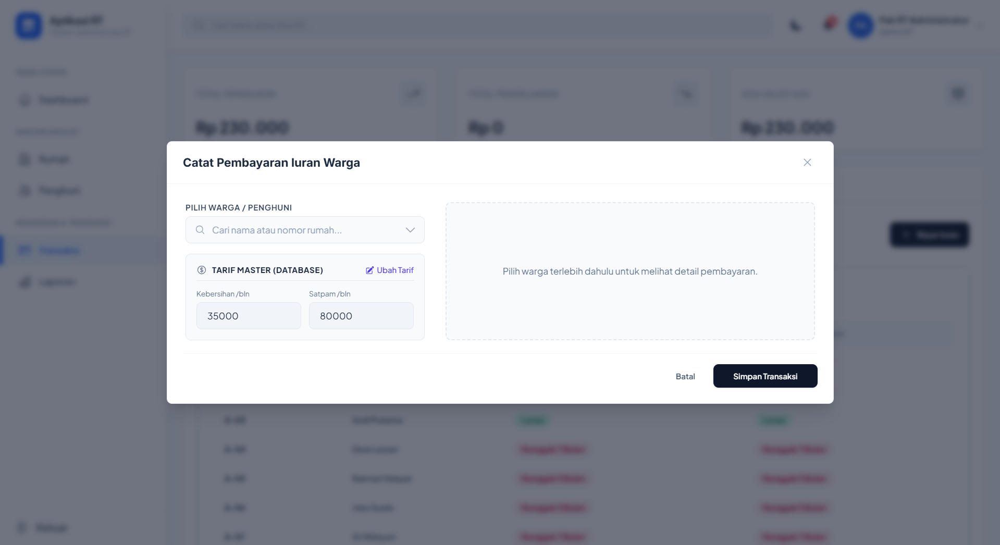
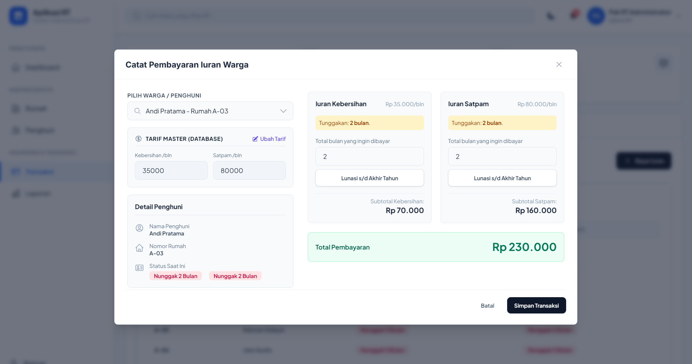
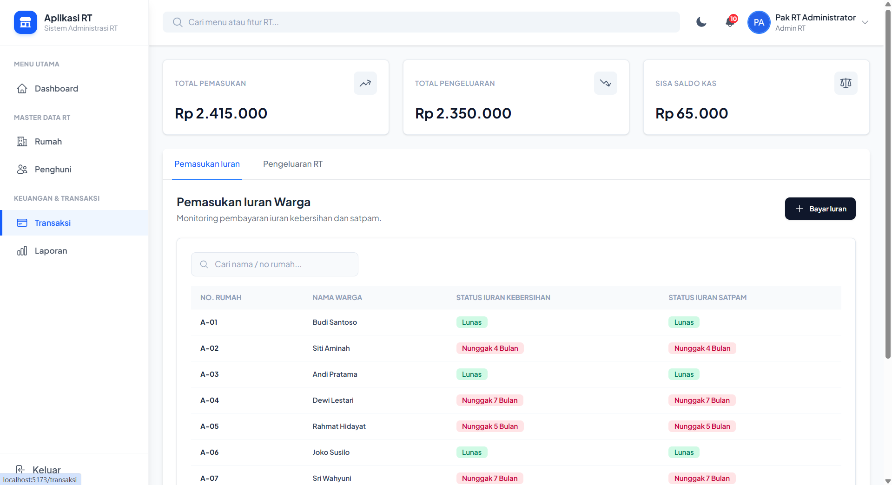

**5. Halaman Pengeluaran**
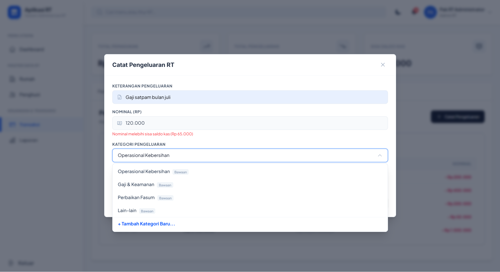
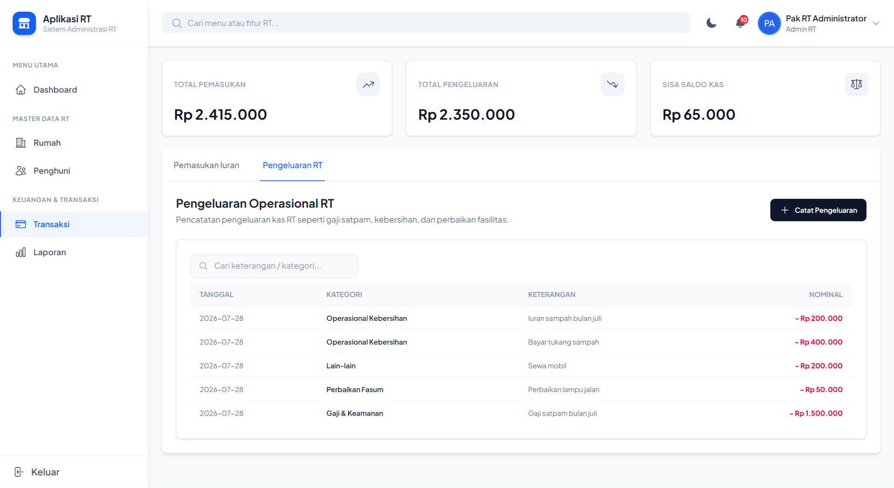

**5. Halaman Laporan**
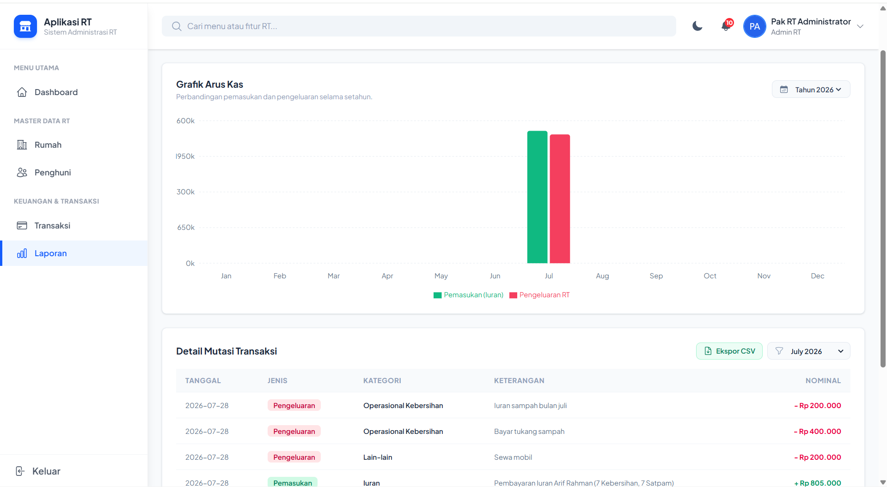
